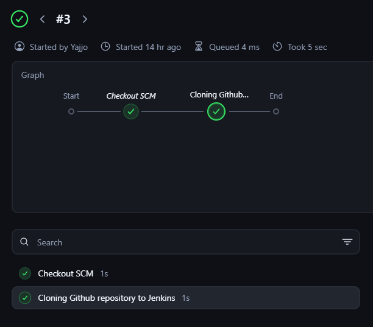
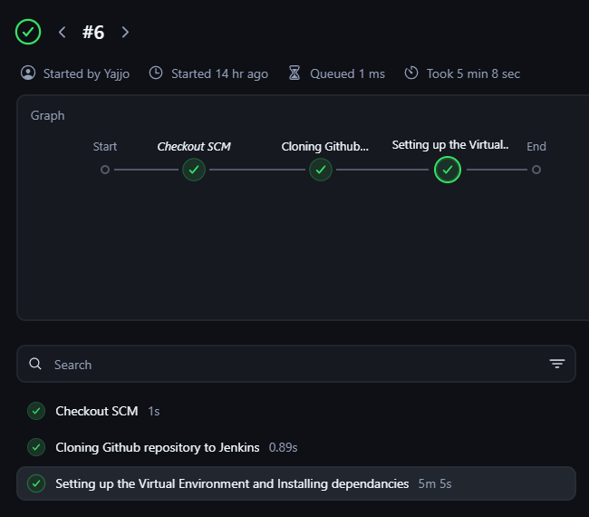
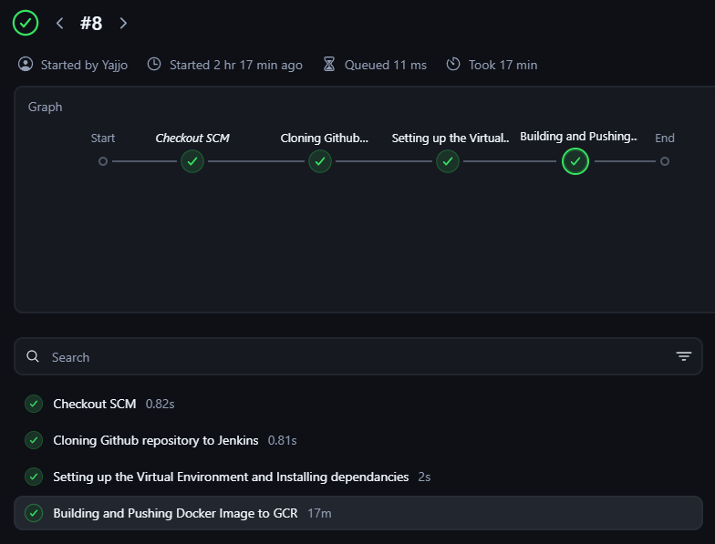
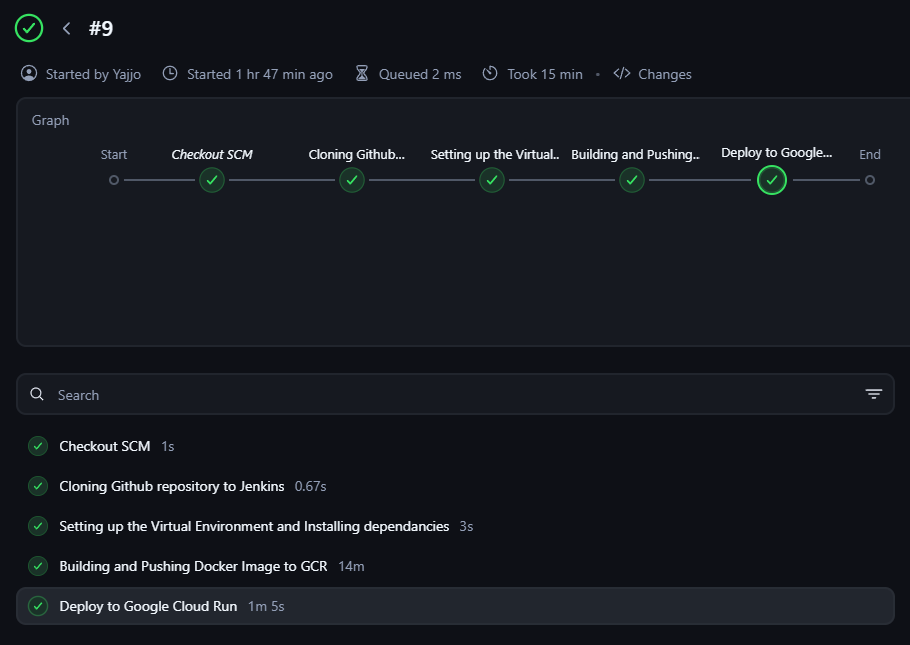
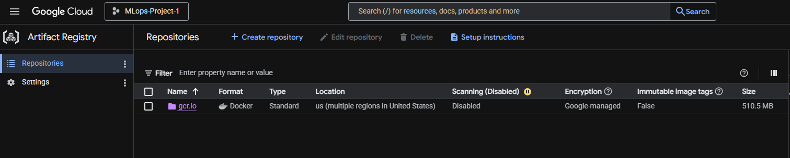
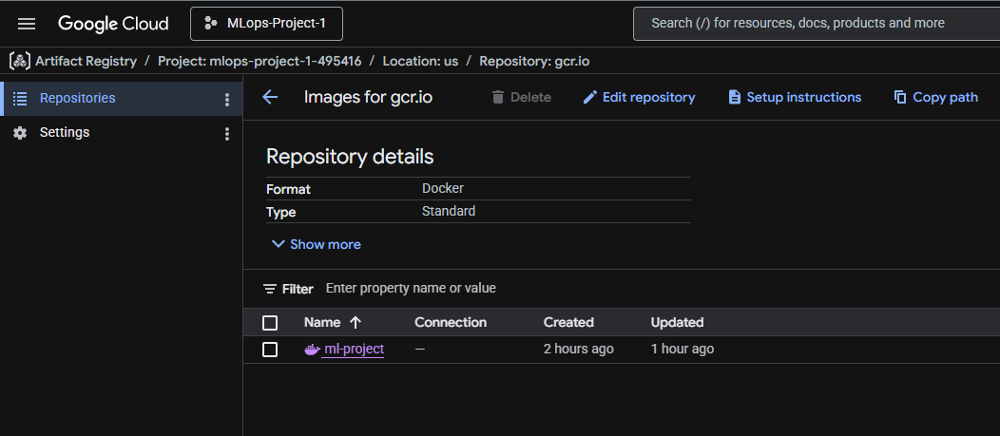
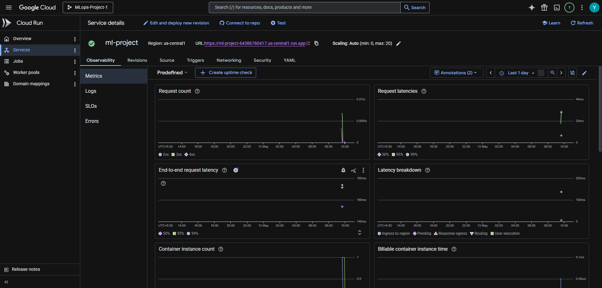
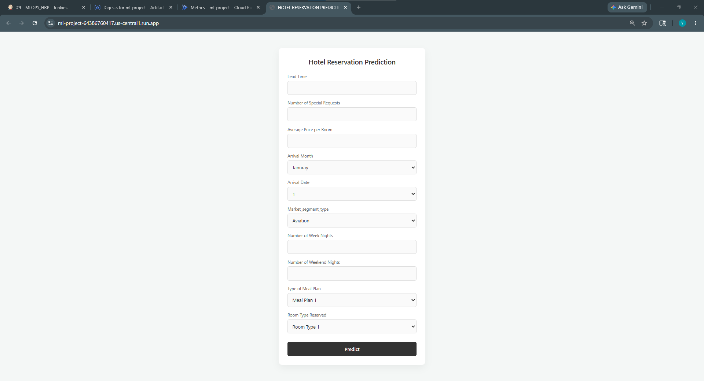
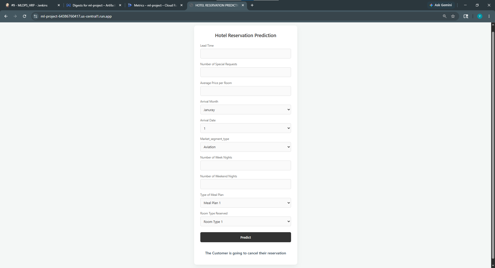

# Hotel Reservation Cancellation Prediction — MLOps Project
 
This is an end-to-end Machine Learning project where I built a system that predicts whether a hotel booking will be **cancelled or not**. The project covers everything from pulling data from Google Cloud to training a model and serving predictions through a web app built with Flask.
 
I built this project to practice real-world MLOps concepts like pipelines, experiment tracking, modular code, and logging — stuff that goes beyond just writing a Jupyter notebook.
 
---

## Project Overview

Given details about a hotel reservation (like how far in advance it was booked, the number of special requests, the room type, etc.), the model predicts:
 
- **"The Customer is going to cancel their reservation"**
- **"The Customer is not going to cancel their reservation"**
The prediction is shown on a simple web page where you can fill in a form and hit "Predict".
 
---

## Tech Stack
 
| Category | Tools / Libraries |
|---|---|
| Language | Python |
| ML Model | LightGBM |
| Data Processing | Pandas, NumPy, Scikit-learn, Imbalanced-learn (SMOTE) |
| Experiment Tracking | MLflow |
| Web Framework | Flask |
| Frontend | HTML, CSS |
| Containerization | Docker |
| CI/CD | Jenkins |
| Cloud Platform | Google Cloud Platform (GCS, Artifact Registry, Cloud Run) |
| Config Management | YAML |


---

## Project Structure
 
```
hotel-reservation-mlops/
│
├── application.py                  # Main Flask app — runs the web server
│
├── pipeline/
│   ├── __init__.py
│   └── training_pipeline.py        # Chains data ingestion → preprocessing → model training
│
├── src/
│   ├── __init__.py
│   ├── data_ingestion.py           # Downloads data from GCS bucket and splits into train/test
│   ├── data_preprocessing.py       # Cleans, encodes, balances, and selects features
│   ├── model_training.py           # Trains LightGBM model with hyperparameter tuning + MLflow tracking
│   ├── logger.py                   # Custom logging setup (saves logs to /logs folder by date)
│   └── custom_exception.py         # Custom exception class with file name and line number info
│
├── config/
│   ├── __init__.py
│   ├── config.yaml                 # All project config — bucket name, column names, thresholds, etc.
│   ├── model_params.py             # LightGBM hyperparameter distributions for RandomizedSearchCV
│   └── paths_config.py             # All file/folder paths in one place (raw, processed, model output)
│
├── utils/
│   ├── __init__.py
│   └── common_functions.py         # Utility functions — read_yaml() and load_data()
│
├── artifacts/
│   ├── raw/
│   │   ├── raw.csv                 # Full dataset downloaded from GCS
│   │   ├── train.csv               # 80% training split
│   │   └── test.csv                # 20% testing split
│   ├── processed/
│   │   ├── processed_train.csv     # Cleaned and feature-selected training data
│   │   └── processed_test.csv      # Cleaned and feature-selected testing data
│   └── models/
│       └── lgbm_model.pkl          # Trained and saved LightGBM model
│
├── notebook/
│   ├── notebook.ipynb              # EDA and experimentation notebook
│   └── train.csv                   # Copy of training data used during notebook exploration
│
├── templates/
│   └── index.html                  # HTML form for the Flask web app UI
│
├── static/
│   └── style.css                   # CSS styling for the web app
│
├── custom_jenkins/
│   └── Dockerfile                  # Custom Jenkins Docker image with Docker CLI installed inside it
│
├── Dockerfile                      # Docker image for the Flask app itself
├── Jenkinsfile                     # Jenkins pipeline definition (4 stages)
├── setup.py                        # Makes the project installable as a Python package
├── requirements.txt                # All Python dependencies
└── .gitignore                      # Ignores venv, logs, mlruns, __pycache__, etc.
```

---
 
## How the ML Pipeline Works
 
The full pipeline is kicked off by running `pipeline/training_pipeline.py`. It runs three steps in order:
 
### Step 1 — Data Ingestion (`src/data_ingestion.py`)
 
- Connects to a **Google Cloud Storage (GCS)** bucket called `hotel_resrn_mlproject_data`
- Downloads the dataset file `Hotel_Reservations.csv` and saves it to `artifacts/raw/raw.csv`
- Splits the data into 80% training and 20% testing, saving them as `train.csv` and `test.csv`
### Step 2 — Data Preprocessing (`src/data_preprocessing.py`)
 
- Drops unnecessary columns (`Booking_ID`, `Unnamed: 0`) and removes duplicate rows
- Applies **Label Encoding** on categorical columns like `type_of_meal_plan`, `room_type_reserved`, `market_segment_type`, etc.
- Handles **skewed numerical data** — if a column's skewness is greater than the threshold (5), it applies `log1p` transformation
- Applies **SMOTE** (Synthetic Minority Oversampling Technique) to handle class imbalance in the target column `booking_status`
- Uses a **Random Forest Classifier** to rank feature importances and selects the top 10 most important features
- Saves processed train and test CSVs to `artifacts/processed/`
### Step 3 — Model Training (`src/model_training.py`)
 
- Loads the processed data and splits into `X_train`, `y_train`, `X_test`, `y_test`
- Runs **RandomizedSearchCV** on a **LightGBM Classifier** to find the best hyperparameters (like `n_estimators`, `max_depth`, `learning_rate`, etc.)
- Evaluates the best model on test data and calculates Accuracy, Precision, Recall, and F1-Score
- Saves the trained model as `artifacts/models/lgbm_model.pkl` using joblib
- Logs everything (parameters, metrics, artifacts/datasets) to **MLflow** using a local SQLite backend (`mlflow.db`)
To view the MLflow tracking UI after training, run:
```bash
mlflow ui --backend-store-uri sqlite:///mlflow.db
```
Then open `http://127.0.0.1:5000` in your browser.
 
---

## 🌐 Flask Web App (`application.py`)
 
The web app is a simple form where you enter reservation details and the saved model predicts whether the booking will be cancelled.
 
**Input features used by the app:**
 
| Feature | Description |
|---|---|
| Lead Time | Days between booking and arrival |
| Number of Special Requests | How many special requests the guest made |
| Average Price Per Room | Per-night room price |
| Arrival Month | Month of arrival (1–12) |
| Arrival Date | Day of the month (1–31) |
| Market Segment Type | Aviation / Complimentary / Corporate / Offline / Online |
| Number of Week Nights | Nights staying on weekdays |
| Number of Weekend Nights | Nights staying on the weekend |
| Type of Meal Plan | Meal Plan 1 / 2 / 3 / Not Selected |
| Room Type Reserved | Room Type 1 through 7 |
 
On form submission, the features are passed to `model.predict()` and the result is displayed on the same page
  - **Prediction = 0** → "The Customer is going to cancel their reservation"
  - **Prediction = 1** → "The Customer is not going to cancel their reservation"

The model is loaded once when the app starts (`joblib.load`) and reused for every prediction request.

---

---
 
## CI/CD with Jenkins
 
The CI/CD pipeline is defined in `Jenkinsfile` and has **4 stages**:
 
| Stage | What it does |
|---|---|
| **Cloning Github repository to Jenkins** | Pulls the latest code from this GitHub repo onto the Jenkins server |
| **Setting up the Virtual Environment and Installing dependencies** | Creates a Python venv inside Jenkins, activates it, and runs `pip install -e .` |
| **Building and Pushing Docker Image to GCR** | Authenticates with GCP using a service account key, builds the Docker image, and pushes it to Google Container Registry |
| **Deploy to Google Cloud Run** | Deploys the pushed Docker image to Google Cloud Run in the `us-central1` region, making it publicly accessible |
 
### Custom Jenkins Docker Image (`custom_jenkins/Dockerfile`)
 
A custom Jenkins image was built on top of `jenkins/jenkins:lts`. It installs Docker CLI inside the Jenkins container so that Jenkins can run `docker build` and `docker push` commands as part of the pipeline. The `jenkins` user is added to the `docker` group so it has the necessary permissions.
 
### App Dockerfile (`Dockerfile`)
 
The main Dockerfile for the Flask application:
- Starts from a lightweight `python:slim` base image
- Installs `libgomp1` (required by LightGBM)
- Copies all project files into `/app`
- Runs `pip install -e .` to install all dependencies
- Runs `python pipeline/training_pipeline.py` to train the model inside the container at build time
- Exposes port `5000` and starts the Flask app with `python application.py`
---

## Project Setup
 
There are two ways to set up and run this project:
 
### Setup 1 — Run Locally (Recommended for Beginners)
 
This is the straightforward way — just clone the repo, create a Python virtual environment, install dependencies, train the model, and run the app.
 
> **Note:** Data ingestion downloads the dataset from a GCS bucket. If you don't have access to that bucket, you can manually place the `Hotel_Reservations.csv` file in `artifacts/raw/` and rename it to `raw.csv`, then skip straight to the data preprocessing step by running `src/data_preprocessing.py` directly.
 
**Step 1 — Clone the repository**
 
```bash
git clone https://github.com/Yajat003/hotel-reservation-mlops.git
cd hotel-reservation-mlops
```
 
**Step 2 — Create and activate a Python virtual environment**
 
```bash
python -m venv .venv
```
 
On Windows:
```bash
.venv\Scripts\activate
```
 
On Mac/Linux:
```bash
source .venv/bin/activate
```
 
**Step 3 — Install all dependencies**
 
```bash
pip install -e .
```
 
This uses `setup.py` to install the project as a package along with all the libraries listed in `requirements.txt`.
 
**Step 4 — Run the full training pipeline**
 
```bash
python pipeline/training_pipeline.py
```
 
This will run data ingestion (downloads from GCS), data preprocessing, and model training in sequence. The trained model will be saved to `artifacts/models/lgbm_model.pkl`.
 
**Step 5 — (Optional) View MLflow experiment tracking**
 
```bash
mlflow ui --backend-store-uri sqlite:///mlflow.db
```
 
Open `http://127.0.0.1:5000` in your browser to see the logged runs, parameters, and metrics.
 
**Step 6 — Run the Flask app**
 
```bash
python application.py
```
 
Open your browser and go to `http://localhost:8080` to use the prediction form.
 
## Individual Step Execution
 
You can also run each step independently if needed:
 
```bash
# Only data ingestion
python src/data_ingestion.py
 
# Only preprocessing
python src/data_preprocessing.py
 
# Only model training
python src/model_training.py
```

---
 
### Setup 2 — Deploy on Google Cloud Platform

To Be Added

---

## CI/CD Pipeline Screenshots
 
The following screenshots show the Jenkins CI/CD pipeline being run for all four stages.
 
### Stage 1 — Cloning the GitHub Repository



---
 
### Stage 2 — Setting Up the Virtual Environment and Installing Dependencies
 
 


---

### Stage 3 — Building and Pushing Docker Image to GCR
 
 

 
---

### Stage 4 — Deploy to Google Cloud Run
 
 


---

### Google Artifact Registry — Docker Image
 
 


 
---

### Google Cloud Run — Deployed App with URL
 
 


--- 
### Live App in Browser — Prediction Results
 




 
---

## What I Learned From This Project
 
- How to structure an ML project like a proper software project (not just a notebook)
- How to use Google Cloud Storage to store and retrieve datasets
- How to handle imbalanced datasets using SMOTE
- How to use RandomizedSearchCV for hyperparameter tuning
- How to track ML experiments using MLflow
- How to build a simple prediction web app using Flask
- How to write reusable logging and custom exception handling utilities
- How to make a Python project installable using `setup.py`

---

> I built this project as a learning exercise to understand how MLOps concepts are applied in a real project. It is not production-ready but covers most of the core ideas like pipelines, experiment tracking, modular code, and model serving